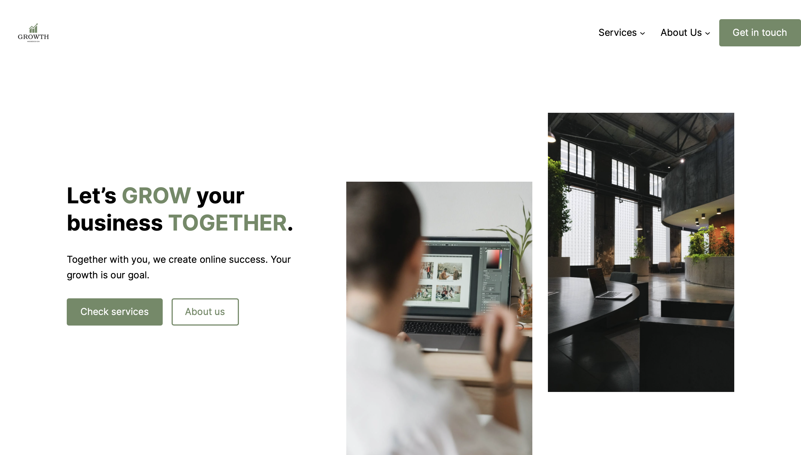
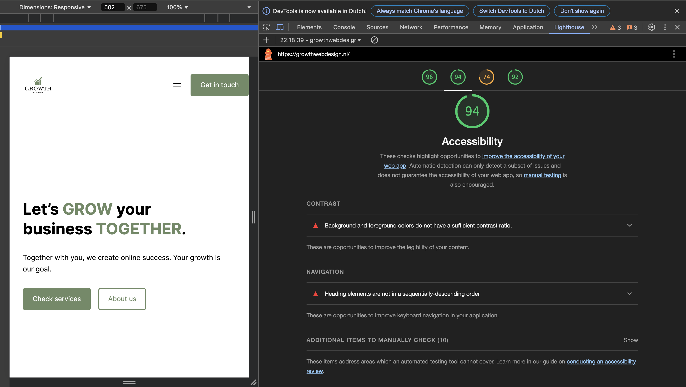

# WCAG Audit 

Doe een WCAG audit op een bestaande website uit je eigen omgeving en rapporteer daarover.

De instructies van deze opdracht staan in [INSTRUCTIONS](https://github.com/fdnd-task/wcag-audit/blob/main/docs/INSTRUCTIONS.md).
 

## Titel Website

Welke website heb je getest? Beschrijf de website en voeg een screenshot toe.

De website die ik heb getest is <a href="(https://growthwebdesign.nl)">GROWTH Webdesign</a>, ik heb deze website zelf gemaakt. De website gaat over het bouwen van websites voor bedrijven.

Toon een screenshot van het Lighthouse Accessibility testresultaat.

Schrijf een samenvatting van de testbevindingen, en link naar je Wiki voor de volledige documentatie.

2 punten die verbeterd kunnen worden in de accessibility na de Lighthouse test, keyboard test en screen reader test werken allebei, headings and landmarks test gebruik veel H2 elementen en bijna geen H1 titels. Lees meer in mijn <a href="https://github.com/RenzoWille/wcag-audit/wiki/WCAG-Audit">Wiki</a>.

## Licentie

This project is licensed under the terms of the [MIT license](./LICENSE).
